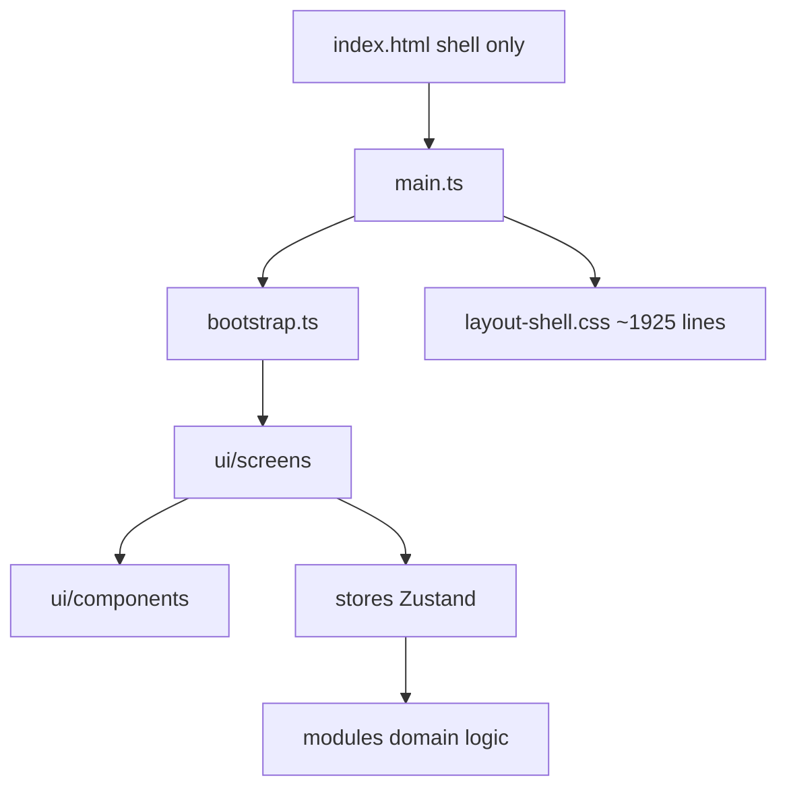
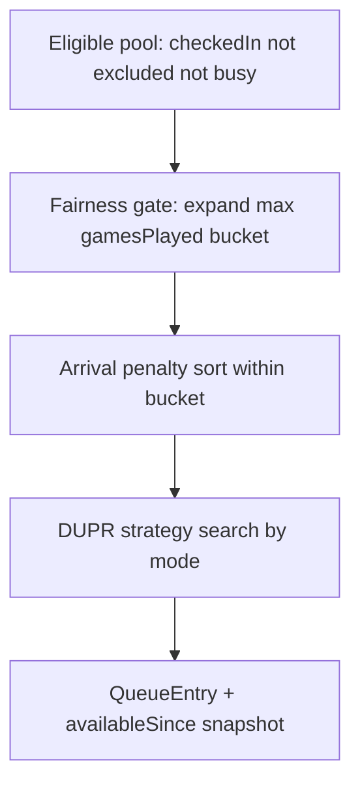
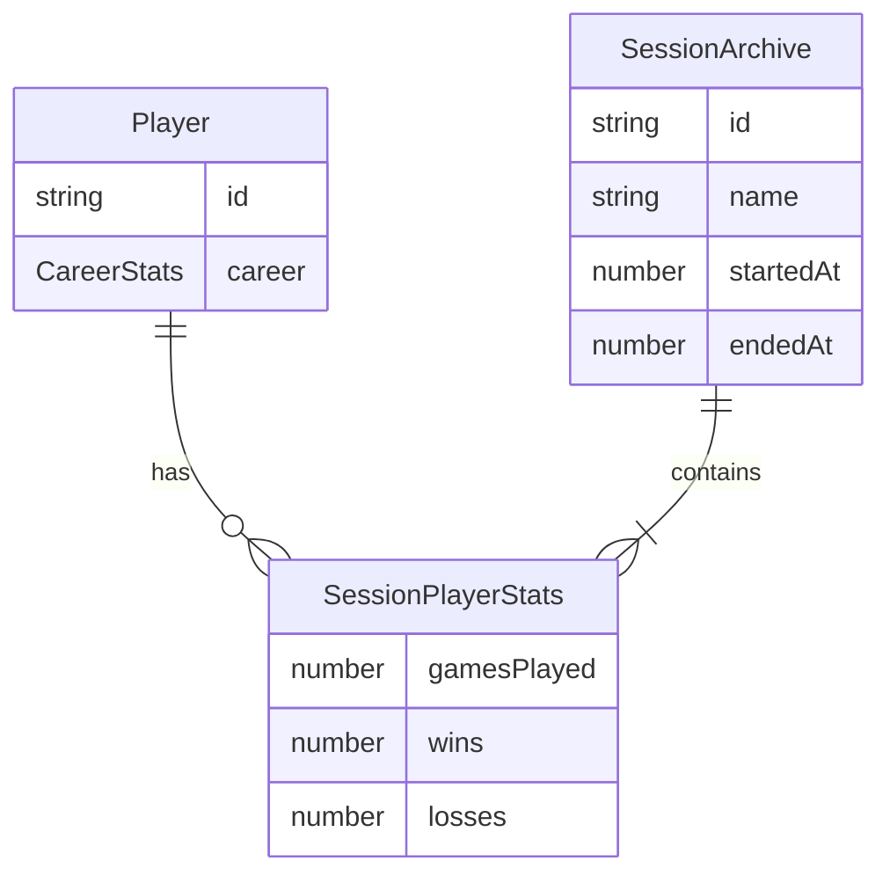
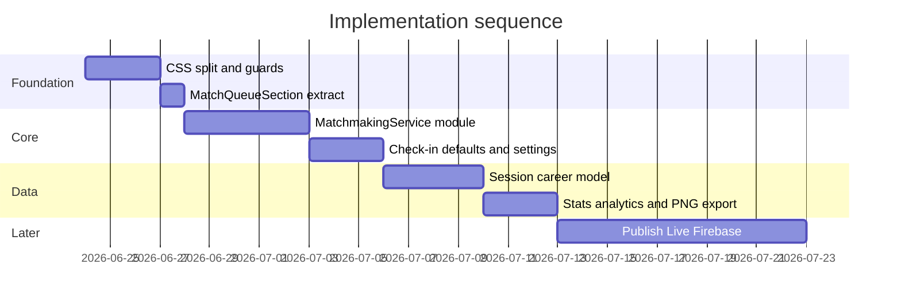

# Dink Syndicate — Modularization & Find Match Roadmap

> Reference document for agents and contributors.  
> Companion to [DINK-SYNDICATE-LAUNCH-PLAN.md](./DINK-SYNDICATE-LAUNCH-PLAN.md) (product phases).  
> This file covers **implementation architecture**: CSS modularization, Find Match engine, check-in, career stats, and local Stats enhancements.  
> **Publish Live is deferred** until Firebase + Cloudflare are set up.

---

## Implementation checklist

- [x] **Phase 1 — CSS:** Split `layout-shell.css` into `css/features/*` + `css/shell/*`; add `check-no-monolith-css.mjs`; remove dead `.queue-item` CSS
- [x] **Phase 1 — UI:** Extract `MatchQueueSection` component; fix `dom-utils` optional attrs typing
- [x] **Phase 2 — Matchmaking:** Create `src/modules/matchmaking/` with FairnessRanker, DuprBalance, mode strategies; migrate `build*` from QueueService
- [x] **Phase 2 — Tests:** Port QueueService match tests to matchmaking; add arrival penalty and check-in exclusion tests
- [x] **Phase 3 — Check-in:** Default new players `checkedIn: false`; add `checkedInAt`; Settings for `sessionStartTime` + `arrivalGraceMinutes`
- [x] **Phase 3 — Wire:** Wire session settings into FairnessRanker; deprioritize late check-ins in Find Match
- [x] **Phase 4 — Career:** AppData v2: career stats + SessionArchive; End Session / New Session flows; migration on hydrate
- [x] **Phase 5 — Stats:** Stats tab queue analytics + export session/rankings PNG (local download)
- [ ] **Phase 6 — Parked:** Publish Live hooks only; implement after Firebase + Cloudflare setup

---

## Current state (healthy baseline)



- **index.html is safe:** ~66 lines, single module entry, build guard [`scripts/check-no-monolith.mjs`](scripts/check-no-monolith.mjs) (max 80 inline script lines).
- **Real monolith risk:** [`css/layout-shell.css`](css/layout-shell.css) (~1,925 lines), not HTML.
- **Create Match today:** [`src/stores/queueStore.ts`](src/stores/queueStore.ts) → [`src/modules/queue/QueueService.ts`](src/modules/queue/QueueService.ts) with mode-specific builders; fairness = `gamesPlayed` then DUPR; no arrival penalty; skill tiers are **display-only** ([`src/lib/skill-utils.ts`](src/lib/skill-utils.ts)).
- **Player pool filter:** `checkedIn && !excluded && not busy` — but new players default **`checkedIn: true`** in [`src/types/player.ts`](src/types/player.ts) (wrong for intended workflow).
- **Publish Live:** not implemented; **parked** until Firebase + Cloudflare setup.

---

## Design decisions locked in

| Topic | Decision |
| ----- | -------- |
| Mirror / balance | **DUPR-primary** pairing (rating gaps, team avg balance). Skill tiers stay for UI badges only. |
| Find Match priority | 1) Fewest games played → 2) Arrival penalty (late check-ins deprioritized) → 3) DUPR-balanced teams |
| Publish Live | **Deferred** — document hook points only; implement after Firebase/Cloudflare |
| New players | Start **not checked in**; only checked-in players appear in Available Players / Find Match pool |

---

## Phase 1 — Structural refactor (prevent monolith growth)

**Goal:** Split the CSS monolith and thin orchestration layers before adding features.

### 1A. Split CSS

Replace single import in [`src/main.ts`](src/main.ts) with a barrel:

```
css/
  themes.css                 (unchanged — tokens)
  index.css                  (@import all)
  shell/layout.css           (app shell, nav, tabs, buttons, forms)
  features/queue.css         (queue section, match cards, timers, create-match btn)
  features/players.css       (roster, filters, registration)
  features/courts.css        (court cards, modals)
  features/match-board.css   (court board, player chips, active matches)
  features/stats.css         (stats table, export targets)
```

- Move rules from [`css/layout-shell.css`](css/layout-shell.css) by section comments (`.queue-*`, `.players-*`, `.match-*`, etc.).
- **Delete dead CSS:** `.queue-item*` blocks (no references in `src/`).
- Add [`scripts/check-no-monolith-css.mjs`](scripts/check-no-monolith-css.mjs): fail build if any CSS file exceeds **600 lines** (same pattern as HTML guard).
- Wire into `package.json` `build` script next to existing monolith check.

### 1B. Thin UI orchestration

- Extract [`src/ui/components/MatchQueueSection.ts`](src/ui/components/MatchQueueSection.ts) from [`src/ui/screens/QueueScreen.ts`](src/ui/screens/QueueScreen.ts): stat cards, court format, match mode, queue list wiring (~80 lines moved).
- Fix [`src/lib/dom-utils.ts`](src/lib/dom-utils.ts) attrs typing (`Record<string, string | undefined>`) — already skips `undefined` at runtime; clears TS errors on optional `disabled`.

**Exit criteria:** `npm run build` passes; visual regression check on Queue / Players / Courts tabs; no file >600 lines in `css/features/`.

---

## Phase 2 — Dedicated Find Match module

**Goal:** One authoritative matchmaking pipeline used exclusively by Create Match (and future “Find Match” label if renamed in UI).

### 2A. New module layout

```
src/modules/matchmaking/
  MatchmakingService.ts      # public API: buildMatch(request) → QueueEntry | null
  FairnessRanker.ts          # gamesPlayed, arrival penalty, candidate ordering
  DuprBalance.ts             # pair/team gap rules (reuse + extend QueueService helpers)
  strategies/
    doublesBalanced.ts
    mixedDoubles.ts
    sameGenderDoubles.ts
    singles.ts
  types.ts                   # MatchmakingRequest, MatchmakingContext
  __tests__/                 # port + expand QueueService tests
```

[`src/modules/queue/QueueService.ts`](src/modules/queue/QueueService.ts) becomes a thin facade: `getAvailablePlayers`, `enqueue`, `startMatch`, `dequeue` stay; all `build*` moves to `MatchmakingService`.

[`src/stores/queueStore.ts`](src/stores/queueStore.ts) `createMatch()` calls **one** method:

```ts
matchmakingService.buildMatch({
  courtFormat,
  matchMode,
  players,
  queueState,
  sessionSettings,  // start time, grace minutes
})
```

### 2B. Find Match priority pipeline



**Fairness gate** (keep Smash-style behavior):

- Prefer players with fewer `gamesPlayed`; expand max-games ceiling until a valid match exists (already done for singles/same-gender — extend consistently to all doubles modes).

**DUPR balance** (numeric, not tier-mirror):

- Reuse existing thresholds from `QueueService`: internal pair gap ≤1.5 DUPR (≤2.5 for near-identical ratings), team avg diff ≤0.75 (≤1.0 mirror), overall span ≤2.5.
- **Doubles “Balanced” upgrade:** replace naive “first 4 + 1+4 vs 2+3” with combinatorial search (like same-gender) scoring `|teamAvgA - teamAvgB| + totalGames + arrivalPenalty`.
- Skill tiers (`beginner`/`expert`) remain **labels on chips only**; matching uses `duprDoublesRating` / `duprSinglesRating`.

**Arrival penalty** (requires Phase 3 settings — stub context with defaults until then):

- `lateMinutes = max(0, checkedInAt - sessionStartTime - graceMinutes)`
- Sort penalty: `gamesPlayed * 1000 + lateMinutes * 10 + dupr` (weights tunable in config).
- Late players still eligible, just **deprioritized** — never hard-excluded unless added later.

### 2C. Config centralization

Extend [`src/config/queue-match-modes.ts`](src/config/queue-match-modes.ts) or add [`src/config/matchmaking.ts`](src/config/matchmaking.ts):

- DUPR gap constants (single source — today duplicated across private methods)
- Arrival penalty weights
- Error messages for “no balanced match found”

### 2D. Tests (required before UI polish)

Port tests from [`src/modules/queue/__tests__/QueueService.test.ts`](src/modules/queue/__tests__/QueueService.test.ts) and add:

- Games-first selection beats higher DUPR with more games
- Late arrival deprioritized vs on-time equal-games player
- Doubles search finds better balance than first-4 heuristic
- Unavailable players (not checked in) never selected

**Exit criteria:** Create Match behavior unchanged or improved; all new tests green; `QueueService` build methods deleted or delegated.

---

## Phase 3 — Session settings, check-in, and arrival penalty

### 3A. Player defaults (check-in workflow)

Update [`src/types/player.ts`](src/types/player.ts) + `createPlayer()`:

| Field | New default | Notes |
| ----- | ----------- | ----- |
| `checkedIn` | `false` | Added players wait until organizer checks them in |
| `availableSince` | `undefined` | Set on check-in in [`PlayerService.toggleCheckIn`](src/modules/players/PlayerService.ts) |
| `checkedInAt` | `undefined` | **New** — timestamp of latest check-in |

Update [`PlayerCard`](src/ui/components/PlayerCard.ts) / roster copy so “Available Players” and Find Match only include checked-in players (filter already exists; defaults were the bug).

Bulk add in [`PlayerService.bulkAddPlayers`](src/modules/players/PlayerService.ts): same defaults.

### 3B. Session settings extension

Extend [`src/types/app-data.ts`](src/types/app-data.ts) `settings`:

```ts
settings: {
  courtCount,
  organizerName,
  sessionStartTime?: number,      // ms timestamp (today's session start)
  arrivalGraceMinutes?: number,   // default e.g. 10
  arrivalPenaltyEnabled?: boolean // default true
}
```

Add **Session** section in [`src/ui/screens/SettingsScreen.ts`](src/ui/screens/SettingsScreen.ts):

- Time picker (or datetime-local) for **Session start time**
- Number input for **Grace period (minutes)** before late penalty applies
- Toggle: **Penalize late arrivals in Find Match**
- Button: **Set start time to now** (quick action at session open)

Persist via [`sessionStore.persistSnapshot`](src/stores/sessionStore.ts).

### 3C. Wire settings into matchmaking

`FairnessRanker` reads settings + `player.checkedInAt` at match build time.

**Exit criteria:** Late check-in demonstrably lowers priority in tests; unchecked-in new players never in Available list.

---

## Phase 4 — Session vs career stats (recurring clubs)

**Problem today:** [`Player.gamesPlayed/wins/losses`](src/types/player.ts) accumulate forever in one snapshot — no concept of “Tuesday night session” vs “lifetime career.”

### 4A. Data model (version bump `AppData.version` → 2)



- **`Player.career`:** lifetime `{ gamesPlayed, wins, losses }` — updated on every match completion.
- **`SessionArchive[]`** in `AppData`: snapshot when organizer taps **End Session** in Settings.
- **`currentSessionStats`** on each player (or embedded in active session): reset when new session starts.

### 4B. Session lifecycle UX

Settings additions:

- **Start new session** — archives current stats (optional name: “Jun 23 Open Play”), resets session counters + queue, keeps player roster + career ranks.
- **End session & archive** — same without immediately starting new.
- Home / Stats toggle: **This session** vs **Career** rankings.

### 4C. Migration

On hydrate: if `AppData.version < 2`, copy existing `gamesPlayed/wins/losses` into both `career` and `currentSessionStats` so nothing is lost.

**Exit criteria:** End session preserves history; new session starts fresh session stats; career totals monotonic.

---

## Phase 5 — Stats enhancements (local, no Publish Live)

**Deferred:** Publish Live public URL, realtime spectator page — implement after Firebase Auth + Firestore + Cloudflare Pages routing.

### 5A. Queue analytics (local Stats tab)

Extend [`src/ui/screens/StatsScreen.ts`](src/ui/screens/StatsScreen.ts):

- Avg queue wait (from `completedMatches` / future `queueEvents` if added)
- Matches completed this session / hour
- Longest available-player wait (from `availableSince` snapshots at match time — optional enhancement)
- Open courts utilization estimate

Split UI into sections: **Session summary** | **Player rankings** | **Queue analytics**.

Styles in [`css/features/stats.css`](css/features/stats.css).

### 5B. Export rankings as image

Add [`src/lib/export-image.ts`](src/lib/export-image.ts):

- Target DOM nodes: rankings table + summary stat cards
- Use `html2canvas` (add dependency) or lightweight canvas renderer for offline reliability
- Buttons: **Export session summary PNG** | **Export rankings PNG**
- Filename: `dink-{sessionName}-{date}.png`

No cloud upload — download only (consistent with Phase 1 offline-first).

**Exit criteria:** PNG downloads work offline on Stats screen for both summary and individual rankings table.

---

## Phase 6 — Publish Live (parked — post Firebase/Cloudflare)

When infrastructure is ready, implement:

| Piece | Approach |
| ----- | -------- |
| Write path | Organizer publishes snapshot → Firestore doc `{ sessionId, queueState, players public fields, updatedAt }` |
| Read path | Cloudflare Pages route `/live/:token` → read-only viewer (no auth, token in URL) |
| Stats parity | Viewer shows active matches + queue analytics (read Firestore) |
| Security | Token rotation, optional expiry, no PII beyond names/ratings |

Hook points to prepare now (no implementation):

- `Session.publishToken?: string` in schema
- `StatsScreen` placeholder section: “Publish Live — coming soon”
- Keep JSON export as offline fallback

---

## Suggested implementation order



---

## Files most touched (by phase)

| Phase | Primary files |
| ----- | ------------- |
| 1 | [`css/layout-shell.css`](css/layout-shell.css) → split; [`src/main.ts`](src/main.ts); [`scripts/check-no-monolith-css.mjs`](scripts/check-no-monolith-css.mjs) |
| 2 | New `src/modules/matchmaking/*`; slim [`QueueService.ts`](src/modules/queue/QueueService.ts); [`queueStore.ts`](src/stores/queueStore.ts) |
| 3 | [`player.ts`](src/types/player.ts), [`app-data.ts`](src/types/app-data.ts), [`SettingsScreen.ts`](src/ui/screens/SettingsScreen.ts), [`PlayerService.ts`](src/modules/players/PlayerService.ts) |
| 4 | [`app-data.ts`](src/types/app-data.ts), new `SessionArchive` type, Settings session lifecycle, [`MatchService.applyStats`](src/modules/match/MatchService.ts) |
| 5 | [`StatsScreen.ts`](src/ui/screens/StatsScreen.ts), `export-image.ts` |
| 6 | Firebase config, Firestore rules, viewer route (future) |

---

## Risks and mitigations

- **Scope creep:** Publish Live and career stats are large — strict phase gates; Phase 6 blocked on infra.
- **Data migration:** Version bump with hydrate migration script in [`sessionStore.hydrate`](src/stores/sessionStore.ts).
- **Matchmaking regressions:** Port all existing QueueService tests before deleting builders; add arrival-penalty fixtures.
- **CSS split regressions:** One feature file at a time; screenshot check Queue tab after queue.css extraction.

---

## How to use this with a new agent

1. Point the agent at this file: `@DINK-SYNDICATE-ROADMAP.md`
2. Specify which phase to implement (e.g. “Execute Phase 1 only”).
3. Cross-reference product scope in `@DINK-SYNDICATE-LAUNCH-PLAN.md` for Firebase/DUPR phase timing.
4. Run `npm test` and `npm run build` after each phase; do not skip the monolith guards.
